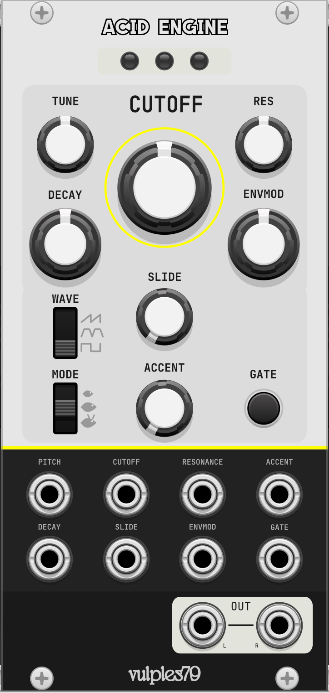

# Acid Engine

A TB-303 acid synth emulation for VCV Rack 2.

<p align="center">
  
</p>

## Overview

Acid Engine brings the iconic sound of the Roland TB-303 to VCV Rack, featuring authentic filter squelch, accent behavior, and slide. The module offers three operational modes ranging from tame to wild.

## Installation

Pre-built `.vcvplugin` files for all supported platforms are available on the [releases page](https://github.com/jjbbllkk/Acid-Engine/releases).

### Download

| Platform | Architecture | File |
|----------|--------------|------|
| macOS (Apple Silicon) | arm64 | `AcidEngine-<version>-mac-arm64.vcvplugin` |
| macOS (Intel) | x86_64 | `AcidEngine-<version>-mac-x64.vcvplugin` |
| Windows | x86_64 | `AcidEngine-<version>-win-x64.vcvplugin` |
| Linux | x86_64 | `AcidEngine-<version>-lin-x64.vcvplugin` |

### Install methods

**Method A — Rack menu (recommended)**

In VCV Rack, choose **Library → Install Plugin from File…** and pick the downloaded `.vcvplugin` file. Restart Rack when prompted.

**Method B — Drop into the plugins folder manually**

Place the `.vcvplugin` file in the plugins folder for your platform/architecture:

| Platform | Folder |
|----------|--------|
| macOS (Apple Silicon) | `~/Library/Application Support/Rack2/plugins-mac-arm64/` |
| macOS (Intel) | `~/Library/Application Support/Rack2/plugins-mac-x64/` |
| Windows (x64) | `%LOCALAPPDATA%\Rack2\plugins-win-x64\` |
| Linux (x64) | `~/.local/share/Rack2/plugins-lin-x64/` |

Restart VCV Rack. Rack unzips the `.vcvplugin` automatically on first launch.

## Build from Source

Requires the [VCV Rack SDK](https://vcvrack.com/manual/Building#Building-Rack-plugins). Set `RACK_DIR` to point at your SDK and run:

```bash
make dist -j
```

The packaged plugin is written to `dist/AcidEngine-<version>-<platform>.vcvplugin`.

To cross-compile for Intel macOS from an Apple Silicon host:

```bash
CROSS_COMPILE=x86_64-apple-darwin make dist -j
```

### Cross-platform builds

Every push runs [`.github/workflows/build.yml`](.github/workflows/build.yml), which builds `.vcvplugin` artifacts for `mac-arm64`, `mac-x64`, `win-x64`, and `lin-x64`. Pushing a `v*` tag attaches all four artifacts to a GitHub Release automatically.

## Controls

### Knobs

| Knob | Description |
|------|-------------|
| **Tuning** | Master tuning offset (+/- 12 semitones) |
| **Cutoff** | Filter cutoff frequency |
| **Resonance** | Filter resonance amount |
| **Decay** | Filter envelope decay time |
| **EnvMod** | Filter envelope modulation depth |
| **Slide** | Portamento/glide time between notes |
| **Accent** | Intensity of accent effect (squelch + volume boost) |

### Switches

| Switch | Options |
|--------|---------|
| **Waveform** | Saw / Blend / Square |
| **Mode** | Baby Fish (tame) / Momma Fish (standard) / Devil Fish (extended ranges) |

### Inputs

| Input | Description |
|-------|-------------|
| **V/Oct** | Pitch CV (1V/octave) |
| **Trig** | Gate/trigger input |
| **Accent** | Gate input (>2.5V triggers accent on that note) |
| **Cutoff CV** | Filter cutoff modulation |
| **Res CV** | Resonance modulation |
| **Decay CV** | Decay time modulation |
| **Slide CV** | Slide amount modulation |
| **EnvMod CV** | Envelope mod depth modulation |

### Outputs

| Output | Description |
|--------|-------------|
| **Out L / Out R** | Audio output (mono, duplicated to both) |

## Accent Behavior

The accent works like a real 303:

- **Accent knob** controls the intensity (how much squelch and volume boost)
- **Accent CV** acts as a gate - send >2.5V to accent that note
- Accented notes get: faster filter envelope (5x shorter decay), extra cutoff modulation, and amplitude boost

## Mode Differences

| Parameter | Baby Fish | Momma Fish | Devil Fish |
|-----------|-----------|------------|------------|
| Cutoff | 200-2000 Hz | 100-4000 Hz | 20-8000 Hz |
| Resonance | 0-50% | 0-80% | 0-100% |
| Decay | 200-1000 ms | 200-2000 ms | 30-3000 ms |
| EnvMod | 0-50% | 0-80% | 0-100% |
| Accent | 0-25% | 0-50% | 0-100% |

## Credits

- **Open303 DSP engine**: [Robin Schmidt](http://www.rs-met.com/) (from the `rosic` library)
- **Noise Engineering Versio Platform Port**: [abluenautilus](https://github.com/abluenautilus)
- **VCV Rack Port**: [Vulpes79](https://github.com/jjbbllkk)

## License

MIT License
